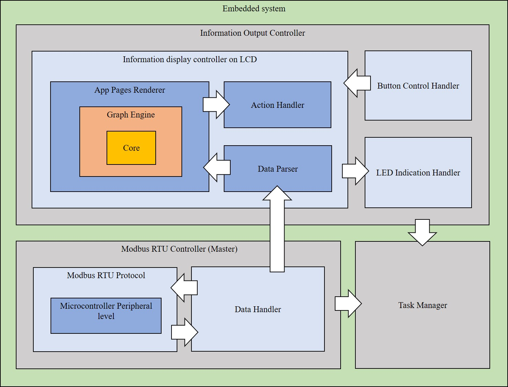

# Пример реализованной архитектуры встраиваемой системы

&ensp;&ensp;&ensp;&ensp;**Core** – самый низкий уровень по работе с LCD. Здесь находятся команды, инструкции, структуры данных и методы для работы с графическим контроллером LCD.\
&ensp;&ensp;&ensp;&ensp;**Graph Engine** – графический движок с реализациями отрисовок примитивной графики и текста.\
&ensp;&ensp;&ensp;&ensp;**App Pages Renderer** – реализация визуального представления каждой из страниц, а также навигации между ними.\
&ensp;&ensp;&ensp;&ensp;**Action Handler** – реализация обработчиков действий для каждой из страниц (перемещение курсора, редактирование элементов, показ превью на заданное время и т.д.).\
&ensp;&ensp;&ensp;&ensp;**Data Parser** – получение данных из обработчика данных Modbus и привязка их к текущей отображаемой странице.\
&ensp;&ensp;&ensp;&ensp;**Information display controller on LCD** – контроллер по работе с отображаемой информацией на экране LCD.\
&ensp;&ensp;&ensp;&ensp;**Button Control Handler** – обработчик кнопок управления (защита от дребезга контактов, алгоритм срабатывания и т.д.).\
&ensp;&ensp;&ensp;&ensp;**LED Indication Handler** – обработчик LED индикаторов (включение и выключение в зависимости от условия и т.д.).\
&ensp;&ensp;&ensp;&ensp;**Information Output Controller** – контроллер по выводу информации пользователю.\
&ensp;&ensp;&ensp;&ensp;**Microcontroller Peripheral level** – реализация методов уровня периферии микроконтроллера (USART, DMA и т.д.).\
&ensp;&ensp;&ensp;&ensp;**Modbus RTU Protocol** – реализация протокола Modbus RTU.\
&ensp;&ensp;&ensp;&ensp;**Data Handler** – обработчик данных Modbus (чтение, запись в хранилище и т.д.).\
&ensp;&ensp;&ensp;&ensp;**Modbus RTU Controller (Master)** – контроллер по работе со slave-устройствами в линии Modbus.\
&ensp;&ensp;&ensp;&ensp;**Task Manager** – диспетчер задач, позволяющий управлять процессами системы.
